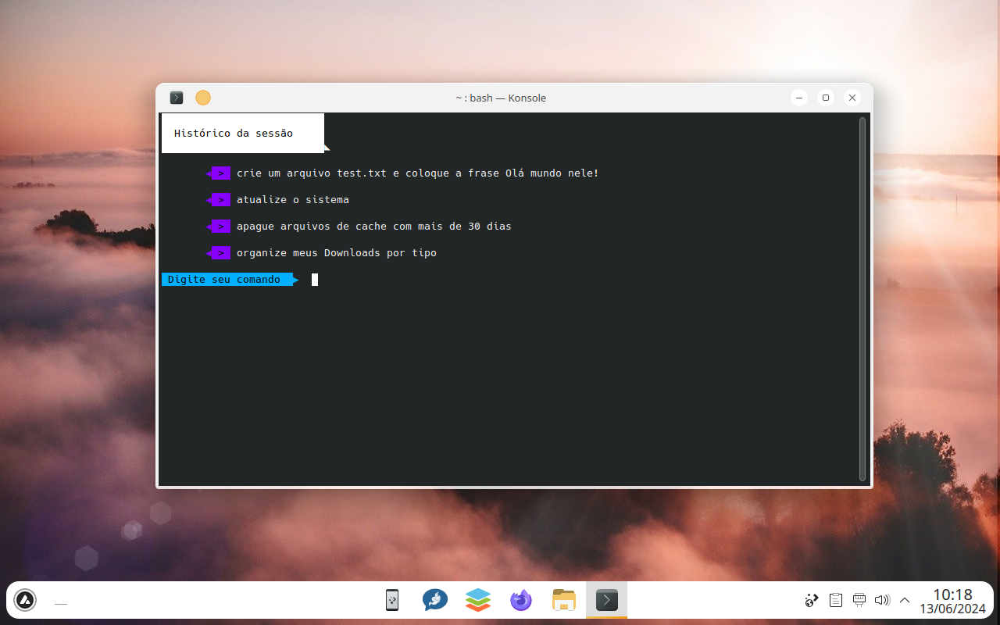

# 📝 Idris v1.0
Idris é uma ferramenta para converter instruções em linguagem natural em scripts executáveis

## 📥 Instalação
Clone o repositório:

```bash
git clone https://github.com/natanael-b/idris.git
cd idris
```

> Idris depende de Lua para funcionar

## 🚀 Uso

1. No menu de apps procure por Idrish
2. Digite os prompts e pressione Enter



#### 🖋️ Sintaxe avançada 

```bash
lua5.4 idris.lua --lang=<código do idioma> --database=<banco de dados com comandos> [--prefix=<prefixo>] [--shell-output] [--verbose] [--help] 'entrada 1' 'entrada 2' ...
```

#### ⚙️ Opções

* `--lang=<código do idioma>`: Especifica o idioma a ser usado.
* `--database=<banco de dados>: Define a fonte dos comandos, se não especificado usa o ´idris-shell`
* `--prefix=<prefixo>`: Adiciona um prefixo opcional aos comandos.
* `--shell-output`: Formata a saída para uso em scripts de shell.
* `--interactive`: Entra no modo interativo.
* `--compile`, `-c`: Gera um banco de dados `database.lua` a partir do arquivo `datasheet.tsv`.
* `--verbose`, `-v`: Ativa a saída verbosa.
* `--debug`, `-d`: Imprime a localização do banco de dados de cada comando.
* `--help`, `-h`: Exibe a mensagem de ajuda.

### 📌 Exemplos

#### Básico
```bash
lua5.4 idris.lua 'crie um arquivo test.txt e insira a frase Hello World nele!'
```

#### Modo interativo

Para entrar no modo interativo, execute o comando nenhuma entrada:

```
lua5.4 idris.lua --lang=pt_BR --database=demonstration
```

# 🤝 Contribuição

Contribuições são bem-vindas! Sinta-se à vontade para abrir uma issue ou um pull request.

# 📜 Licença

Este projeto está licenciado sob a Licença MIT. Veja o arquivo LICENSE para mais detalhes.
